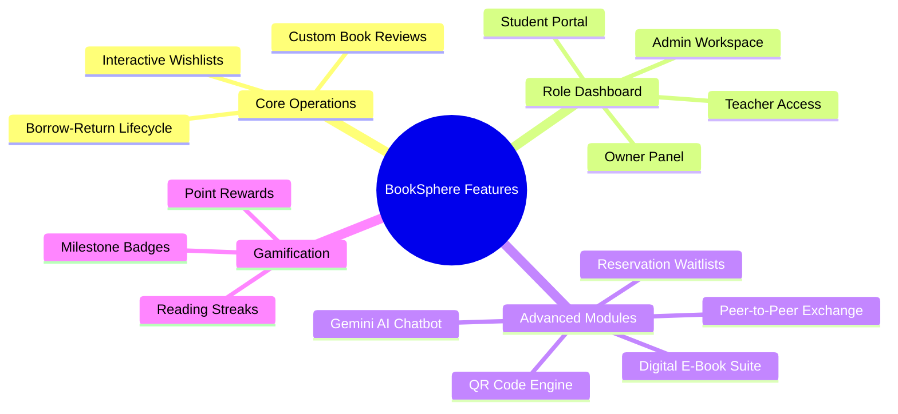

# BookSphere v2.0 — Complete Technical Architecture & Features Blueprint

---

## 💎 Executive Overview

**BookSphere v2.0** is an enterprise-grade, high-performance, and secure **Library Management System** engineered for modern educational institutions (pre-configured for K.R. Mangalam University - KRMU). 

This document provides an exhaustive, **A-to-Z technical architecture specification and feature inventory**. It serves as an ultimate guide to the system’s design, engineering capabilities, security protocols, and operational parameters—entirely free of sensitive credentials.

---

## 🧭 Comprehensive Feature Index (A to Z)



### 👥 1. Role-Adaptive Architecture (RBAC)
BookSphere implements a strict **Role-Based Access Control (RBAC)** model where the user interface dynamically alters its menus, actions, and dashboard stats based on the client's role:
*   **👑 Owner (Top Tier):** Holds absolute governance over the entire library system. Can perform all Admin functions plus create/manage Admin accounts, view financial stats, audit logs, and approve/reject administrative registrations.
*   **🛠️ Admin (Staff Tier):** Manages day-to-day operations. Can add/modify/delete books, handle requests, issue/return/renew physical books, view leaderboard ranks, track overdue fines, and manage Student/Teacher accounts.
*   **👩‍🏫 Teacher (Privileged User):** Enjoys extended borrow limits and reservation priorities. Can search/reserve books, read eBooks, manage a custom wishlist, submit reviews, and chat with the AI assistant.
*   **👨‍🎓 Student (General User):** Accesses standard library features. Can request books, search catalog, manage personal notifications, track their gamified reading streaks/points, swap books with peers, and download PDF eBooks.

---

### 📚 2. Core Book Operations

#### 🔄 The Borrow-Return Lifecycle
*   **Manual/QR Checkout:** Admin can checkout books manually or via a single scan of the physical book’s pre-generated QR code.
*   **Request Approval System:** Students can request a book from their dashboard. An Admin reviews the request, clicks "Approve" (which freezes the book copy for 24 hours), and completes checkout when the student collects it.
*   **Auto-Expiry Guard:** Approved requests that are not physically picked up within 24 hours automatically expire. The copy is instantly unfrozen and returned to the active inventory, and a notification is sent to the student.
*   **Smart Renewals:** Allows students/teachers to extend their return deadline by 7 days, provided the book has no active reservations or waitlist queues.

#### 📍 Advanced Inventory & QR Code Engine
*   **Dynamic Copies Mapping:** Every entry in the catalog maps to distinct physical copies (`BookCopy` schema).
*   **Granular QR Codes:** The backend automatically generates clean, base64-encoded DataURI QR codes for each physical copy (e.g., encoded as `BOOKSPHERE:<BookID>:COPY:<CopyNumber>`).
*   **Shelf Localization:** Copies are automatically assigned spatial coordinates (e.g., Aisle `A2`, Rack `R4`, Position `P3`) for fast staff physical retrieval.
*   **Asset Health Tracking:** Tracks the physical condition of every copy (`new`, `good`, `fair`, `poor`, `damaged`) with a historical log of reported damages and who reported them.

---

### 🚀 3. Next-Generation Interaction Modules

#### 💬 Gemini AI Library Assistant
*   Integrated directly inside the front-end chat interface using the high-performance `@google/genai` API.
*   **Intelligent Prompting:** Powered by a customized system prompt that loads catalog context, current availability, and active library rules.
*   **Capabilities:** Provides natural language recommendations, catalogs search assistance, answers policy questions (e.g., "what is the fine rate?"), and assists with educational research questions.
*   **Offline Resilience:** If the API key is not configured, the assistant gracefully falls back to an offline mode, still providing catalog stats and clear directions to contact the Administrator.

#### 👥 Peer-to-Peer (P2P) Book Exchange
*   Allows students and teachers to trade books directly, reducing administrative strain.
*   **Workflow:** A user initiates an exchange, selecting a book they currently have and specifying the target recipient. The recipient accepts/rejects the trade. Once accepted, the transaction transfers legally to the new borrower upon Admin validation.

#### 🎟️ Active Waitlist / Reservation System
*   If a highly popular book has **zero** available copies, users can join a FIFO (First-In, First-Out) waitlist queue.
*   **Auto-Notification:** When a copy is checked back in, the system checks the queue, automatically transitions the #1 reserved person's status to `notified`, reserves the copy exclusively for them, and gives them 48 hours to claim it before transferring it to the next person.

#### 🏆 Gamified Reader Platform
*   Designed to drive higher educational engagement using modern gamification systems:
*   **Reading Streaks:** Tracks consecutive borrow dates and rewards active reading behavior.
*   **Point System:** Earns points for returning books on-time, writing quality reviews, and maintaining streaks.
*   **Badge Milestones:** Earns custom profile badges (e.g., *Bookworm*, *Streak Master*, *Perfect Return*) displayed on the account dashboard.

---

## 🛡️ 9-Layer Modern Security Blueprint

BookSphere's architecture includes a robust, layered security system directly inside `server.js` to safeguard user data and ensure service availability under heavy workloads:

```
[Incoming Request]
        │
        ├── ❶ Trust Proxy Config (Clouflare/Nginx IP mapping)
        ├── ❷ GZIP Compression (Payload reduction)
        ├── ❸ Strict Body Limits (Max 10KB JSON limits)
        ├── ❹ CORS Whitelists (Allowed origin lockdowns)
        ├── ❺ HTTP Parameter Pollution (HPP parameter guard)
        ├── ❻ Sanitizers (MongoSanitize & XSS sanitization)
        ├── ❼ IP Strike Tracker (Blocks scanning bots after 50 errors)
        ├── ❽ Timeout Guards (Aborts CPU-hanging queries after 30s)
        └── ❾ Multi-Tier Rate Limiters (Global / Write / Auth Speeder)
```

1.  **❶ Trust Proxy Configuration:** Uses `app.set("trust proxy", 1)` to accurately determine client IP addresses behind reverse proxies (like Cloudflare, Nginx, or Heroku), preventing IP spoofing.
2.  **❷ GZIP Compression:** Compresses response bodies on the fly using `compression()`, saving significant server bandwidth and accelerating page loads for mobile users.
3.  **❸ Strict Body Size Limits:** Limits incoming JSON payloads to **10 KB** (`express.json({ limit: "10kb" })`) to prevent server buffer overflows or memory-exhaustion attacks.
4.  **❹ CORS Whitelists:** Enforces a strict, environment-controlled Cross-Origin Resource Sharing (CORS) header. The API rejects requests coming from unauthorized web pages.
5.  **❺ HTTP Parameter Pollution (HPP):** Employs `hpp()` middleware to protect against parameter pollution attacks (e.g., query strings like `?role=admin&role=student` that can bypass naive input checks).
6.  **❻ Database & XSS Sanitizers:**
    *   `mongoSanitize()`: Automatically strips out dangerous query operators (such as `$gt` or `$ne`) from incoming requests, preventing NoSQL injection attacks.
    *   `xss-clean`: Sanitizes user inputs to neutralize malicious HTML/JS payloads, blocking Cross-Site Scripting (XSS) in reviews or comments.
7.  **❼ IP Strike Tracker (Automatic IPS Firewall):** An in-memory monitor that counts client errors (4xx codes, excluding 404s). If an IP generates **50+ errors in a 10-minute window**, it is flagged as a malicious scanner and automatically blocked with a `429 Too Many Requests` code.
8.  **❽ CPU Request Timeout Guard:** Sets a strict **30-second request timeout limit** on all connections. If a complex DB query hangs or a ReDoS (Regular Expression DoS) attempt occurs, the socket is safely severed to preserve system resources.
9.  **❾ Multi-Tier Rate & Speed Limiters:**
    *   *Global API Limit:* Restricts every IP to a maximum of 300 requests per 15 minutes.
    *   *Write Mutation Limit:* Restricts state-changing operations (`POST`, `PUT`, `DELETE`) to a maximum of 50 requests per minute.
    *   *Auth Speed-Limiter:* Dynamically slows down repeated auth requests. If an IP makes more than 5 authentication attempts in 60 seconds, each subsequent request is delayed by an additional **500ms** to render automated brute-force attacks useless.

---

## 🧪 Input Schema & Strict Validation Rules

To prevent data corruption and ensure clean records, BookSphere implements strict schema validation using **Joi** before database entry:

*   **Password Complexity Rules:**
    *   Must be at least **8 characters** long.
    *   Must contain at least **one uppercase letter**.
    *   Must contain at least **one lowercase letter**.
    *   Must contain at least **one number**.
    *   Must contain at least **one special character** (from `!@#$%^&*`).
*   **Domain Registration Restricton:**
    *   Any registering Student, Teacher, or Admin must use an official college domain email address (ends with `@krmu.edu.in`). *Owner* registrations are exempted from this domain restriction to permit system bootstrap configuration.

---

## 🛢️ Database Strategy & Capacity Specs

### 🔌 Dual-Engine Strategy
```
               ┌─────────────────────────────┐
               │    Is MONGODB_URI active?   │
               └──────────────┬──────────────┘
                              │
              ┌───────────────┴───────────────┐
             YES                              NO
              ▼                               ▼
┌───────────────────────────┐   ┌───────────────────────────┐
│ Connect to MongoDB Atlas  │   │ Start Local Memory Server │
│ (AWS Cloud Hosting Cluster)│  │ (Disk Persistent Fallback)│
└───────────────────────────┘   └───────────────────────────┘
```

1.  **MongoDB Atlas (Production Standard):** Connects to a high-availability cloud database hosted on AWS with built-in indexing and continuous optimization.
2.  **Persistent WiredTiger Local Fallback:** If the local server lacks internet access or MongoDB Atlas is offline, BookSphere fires up an embedded `mongodb-memory-server` in the background. It is configured to run the advanced **WiredTiger Storage Engine** pointing to `./backend/data/db`.
    *   *Note: Unlike standard in-memory engines, this fallback fully preserves your database tables across server restarts and machine reboots!*

---

### 📦 Storage & Scale Projections

Based on average document sizes (approx. **0.5 KB** per entry), the system can scale as follows:

| Database Tier | Allocated Size | Max Document Capacity | Typical Campus Scope |
| :--- | :--- | :--- | :--- |
| **MongoDB Atlas (Free M0)** | **512 MB** | **~1,000,000 documents** | Supports **50,000 books**, **10,000 users**, and **500,000 borrow transactions** comfortably. |
| **Local Persistent Disk (SSD)** | **50 GB** | **~100,000,000 documents** | Large enough to hold the complete catalog and transaction history of a metropolitan library system. |

---

## ⏰ Automated Workflows & Background Cron Jobs

BookSphere utilizes a background scheduler (`node-cron`) to run automated system updates without manual administrator intervention:

*   **⏰ Daily Reminder Cron (`0 8 * * *` - Every day at 8:00 AM):**
    *   Queries all active transactions (`status: "issued"`).
    *   **2-Day Warning:** If a book is due in exactly 48 hours, it triggers a warning notification and email.
    *   **Due Today Warning:** If the due date is today, it triggers an urgent return alert.
    *   **Daily Overdue Escalation:** If the book is overdue, it calculates the dynamic fine (₹5 per day), adds it to the user's account, and fires a daily overdue warning.
*   **⏰ Approved Request Expiry Cron (`*/10 * * * *` - Every 10 Minutes):**
    *   Scans the `Request` collection for items approved by an Admin but not claimed within **24 hours**.
    *   Exhausts the request status to `expired`, **automatically increments the book’s available copy count**, and sends a notification informing the user that their hold was released.

---

## 🎨 Frontend Design Systems & Aesthetics

*   **Premium Visuals:** Curated HSL color palette emphasizing deep slate primary tones, smooth turquoise accents, and glassmorphism elements.
*   **Modern Typography:** Styled with the geometric Google Font *Inter*, removing generic browser serif styling.
*   **Fluid Transitions:** Integrates micro-animations, layout scaling, hover state shifts, and custom animated checkmarks on successful actions.
*   **Responsive layouts:** Uses pure Vanilla CSS flexboxes and grid systems to ensure dashboard components scale gracefully from desktop monitors to mobile smartphone screens.
*   **Live Charts & Reports:** Uses clean interactive DOM charts on the Admin Dashboard to visualize real-time checkout metrics, category breakdowns, and popular books.

---

## 🧪 Comprehensive Integrity & Testing Framework

BookSphere is supported by a customized local test execution engine ([test-auth-apis.js](file:///c:/Users/ravin/OneDrive/Documents/college/Sem2/Minar%20Project%20-1/Library%20management%20Main/backend/test-auth-apis.js)) checking **62 targeted assertions** to verify system stability:

```
  🎉 PASS: 62 / 62 Tests Succeeded (100% Success Rate)
```

### 🔬 Test Categories Verified:
1.  **Auth & OTP Routines:** Validate 6-digit OTP delivery, TTL lifetime expiry, and secure registration checks.
2.  **Schema Bounds:** Ensure robust errors are returned for weak passwords, invalid email structures, or unregistered role options.
3.  **Role Access Control (RBAC):** Assert that Students or Teachers are strictly blocked (`403 Forbidden`) from viewing logs, approving requests, blocking members, or changing administrative statuses.
4.  **Account Management Lifecycle:** Test approving requests, blocking/unblocking accounts, and verify that notifications are correctly written to the collection on state changes.
5.  **Rate & Speed Limiter Integrity:** Verify that repetitive fast calls are correctly choked and delayed to protect the server CPU.
